# CLAUDE.md - Code Review Graph Project Context

> **Last Updated**: 2026-04-04 22:00:51
> **Version**: 2.1.0
> **AI Context Coverage**: 100% (Root + 2 modules)

## 变更记录 (Changelog)

### 2026-04-04 22:00:51 - 初始化 AI 上下文
- 🎯 **创建根级 CLAUDE.md**：建立项目愿景、架构总览、模块索引
- 📊 **生成 Mermaid 结构图**：可视化模块依赖关系
- 🗂️ **模块文档初始化**：为核心包和 VS Code 扩展创建详细上下文
- 🔗 **添加导航面包屑**：所有模块文档支持路径导航
- ✅ **覆盖率报告**：完整扫描 62 个 Python 文件、15 个 TypeScript 文件

---

## 项目愿景

**code-review-graph** 是一个持久化、增量更新的代码知识图谱，旨在解决 AI 编码工具的 token 浪费问题。通过 Tree-sitter 解析代码结构、SQLite 存储图谱、MCP 协议暴露接口，实现 8.2 倍平均 token 减少，让 AI 代码审查更智能、更高效。

### 核心价值主张
- **Token 效率**：从全库扫描到精确上下文，平均减少 8.2 倍 token 使用
- **增量更新**：Git 钩子触发，<2 秒完成 2900 文件项目的增量索引
- **Monorepo 支持**：处理 27,700+ 文件的大型 monorepo，仅读取 ~15 个相关文件
- **多语言覆盖**：支持 19 种编程语言 + Jupyter/Databricks notebooks
- **平台集成**：自动配置 Claude Code、Cursor、Windsurf、Zed、Continue、OpenCode、Antigravity

---

## 架构总览

### 技术栈
- **核心包**：Python 3.10+、Tree-sitter、SQLite (WAL mode)、FastMCP
- **VS Code 扩展**：TypeScript、Electron、better-sqlite3、D3.js
- **AI 集成**：MCP (Model Context Protocol) stdio transport
- **可选组件**：sentence-transformers (向量)、igraph (社区检测)、Ollama (wiki 生成)

### 系统架构

```
┌─────────────────────────────────────────────────────────────────┐
│                     AI Coding Platforms                          │
│  (Claude Code | Cursor | Windsurf | Zed | Continue | OpenCode)  │
└────────────────────────────┬────────────────────────────────────┘
                             │ MCP (stdio)
                             ▼
┌─────────────────────────────────────────────────────────────────┐
│                    FastMCP Server                                │
│  22 MCP Tools + 5 Prompts (review_changes, architecture_map,    │
│  debug_issue, onboard_developer, pre_merge_check)              │
└────────────────────────────┬────────────────────────────────────┘
                             │
                             ▼
┌─────────────────────────────────────────────────────────────────┐
│                  Code Review Graph Engine                        │
├─────────────────────────────────────────────────────────────────┤
│  ┌──────────────┐  ┌──────────────┐  ┌──────────────┐          │
│  │   Parser     │  │    Graph     │  │ Incremental  │          │
│  │ (Tree-sitter)│  │  (SQLite)    │  │ (Git hooks)  │          │
│  └──────────────┘  └──────────────┘  └──────────────┘          │
│                                                                   │
│  ┌──────────────┐  ┌──────────────┐  ┌──────────────┐          │
│  │   Flows      │  │  Communities │  │   Search     │          │
│  │ (Execution)  │  │ (Leiden)     │  │ (FTS5+Vec)   │          │
│  └──────────────┘  └──────────────┘  └──────────────┘          │
│                                                                   │
│  ┌──────────────┐  ┌──────────────┐  ┌──────────────┐          │
│  │   Refactor   │  │  Embeddings  │  │  Visualization│          │
│  │ (Analysis)   │  │ (Vector)     │  │  (D3.js)     │          │
│  └──────────────┘  └──────────────┘  └──────────────┘          │
└────────────────────────────┬────────────────────────────────────┘
                             │
                             ▼
┌─────────────────────────────────────────────────────────────────┐
│                   SQLite Graph Database                          │
│  Nodes: File, Class, Function, Type, Test                       │
│  Edges: CALLS, IMPORTS_FROM, INHERITS, IMPLEMENTS,              │
│         CONTAINS, TESTED_BY, DEPENDS_ON                          │
│  Location: .code-review-graph/graph.db (WAL mode)               │
└─────────────────────────────────────────────────────────────────┘
```

### 数据流

1. **初始构建** (`code-review-graph build`)
   - 扫描所有源文件 → Tree-sitter 解析 AST → 提取节点/边 → SQLite 存储

2. **增量更新** (`git commit` / 文件保存)
   - Git diff 检测变化 → SHA-256 哈希比对 → 仅重解析变化文件 → 更新图谱

3. **MCP 查询** (AI 调用工具)
   - 接收查询 → SQLite 图遍历 → BFS 影响半径 → 返回最小文件集

---

## ✨ 模块结构图

```mermaid
graph TD
    A["(根) code-review-graph"] --> B["code_review_graph/"];
    A --> C["code-review-graph-vscode/"];
    A --> D["tests/"];
    A --> E["docs/"];
    A --> F["skills/"];
    A --> G["evaluate/"];

    B --> B1["parser.py - 多语言解析器"];
    B --> B2["graph.py - 图数据库引擎"];
    B --> B3["incremental.py - 增量更新"];
    B --> B4["tools/ - MCP 工具集"];
    B --> B5["flows.py - 执行流检测"];
    B --> B6["communities.py - 社区检测"];
    B --> B7["search.py - 混合搜索"];
    B --> B8["changes.py - 变更影响分析"];
    B --> B9["refactor.py - 重构辅助"];
    B --> B10["embeddings.py - 向量嵌入"];
    B --> B11["visualization.py - D3.js 可视化"];
    B --> B12["wiki.py - Markdown wiki 生成"];
    B --> B13["prompts.py - MCP 提示模板"];
    B --> B14["skills.py - Claude Code 技能"];
    B --> B15["registry.py - 多仓库注册表"];
    B --> B16["migrations.py - 数据库迁移"];
    B --> B17["tsconfig_resolver.py - TS 路径解析"];
    B --> B18["cli.py - CLI 入口"];
    B --> B19["main.py - MCP 服务器"];

    C --> C1["extension.ts - 扩展入口"];
    C --> C2["backend/ - CLI/SQLite 集成"];
    C --> C3["features/ - 核心功能"];
    C --> C4["views/ - UI 视图"];
    C --> C5["webview/ - D3.js 图可视化"];

    D --> D1["test_parser.py"];
    D --> D2["test_graph.py"];
    D --> D3["test_tools.py"];
    D --> D4["test_incremental.py"];
    D --> D5["test_multilang.py"];
    D --> D6["test_integration_v2.py"];

    click B "./code_review_graph/CLAUDE.md" "查看核心包文档"
    click C "./code-review-graph-vscode/CLAUDE.md" "查看 VS Code 扩展文档"
```



---

## 模块索引

| 模块路径 | 语言 | 职责 | 文档覆盖率 | 关键入口 |
|---------|------|------|-----------|---------|
| **code_review_graph/** | Python | 核心包：解析、存储、MCP 服务 | 100% | `cli.py`, `main.py` |
| **code-review-graph-vscode/** | TypeScript | VS Code 扩展：可视化、UI | 100% | `extension.ts` |
| **tests/** | Python | 测试套件：572 测试用例 | N/A | `test_integration_v2.py` |
| **docs/** | Markdown | 用户文档、架构说明 | N/A | `INDEX.md` |
| **skills/** | Markdown | Claude Code 技能定义 | N/A | `build-graph/SKILL.md` |
| **evaluate/** | Python | 评估基准：性能、准确性 | N/A | `runner.py` |

---

## 运行与开发

### 安装
```bash
# 核心包
pip install code-review-graph
# 或使用 uv
uv pip install code-review-graph

# 开发依赖
pip install -e ".[dev,all]"
```

### 核心命令
```bash
# 初始化 (自动检测并配置 AI 平台)
code-review-graph install

# 构建图谱
code-review-graph build

# 增量更新
code-review-graph update

# 监视模式 (自动更新)
code-review-graph watch

# 启动 MCP 服务器
code-review-graph serve

# 可视化图谱
code-review-graph visualize

# 生成 wiki
code-review-graph wiki

# 变更影响分析
code-review-graph detect-changes --base main

# 多仓库管理
code-review-graph register <path>
code-review-graph repos

# 评估基准
code-review-graph eval
```

### 开发命令
```bash
# 代码质量
uv run ruff check code_review_graph/
uv run mypy code_review_graph/ --ignore-missing-imports

# 测试
uv run pytest tests/ --tb=short -q
uv run pytest tests/test_integration_v2.py -v

# 构建 VS Code 扩展
cd code-review-graph-vscode
npm run compile
npm run package
```

---

## 测试策略

### 测试结构 (572 测试用例)
- **单元测试**：`test_parser.py`, `test_graph.py`, `test_incremental.py`
- **多语言测试**：`test_multilang.py` (19 种语言)
- **集成测试**：`test_integration_v2.py` (端到端流程)
- **MCP 工具测试**：`test_tools.py` (22 个工具)
- **功能测试**：`test_flows.py`, `test_communities.py`, `test_search.py`
- **回归测试**：`test_migrations.py` (数据库迁移)

### CI/CD
- **Lint**: ruff (Python 3.10)
- **类型检查**: mypy
- **安全扫描**: bandit
- **测试矩阵**: Python 3.10, 3.11, 3.12, 3.13
- **覆盖率要求**: 50% 最低阈值

---

## 编码规范

### Python (code_review_graph/)
- **行长度**: 100 字符 (ruff)
- **目标版本**: Python 3.10+
- **SQL 安全**: 始终使用参数化查询 (`?` 占位符)，禁止 f-string
- **错误处理**: 捕获特定异常，使用 `logger.warning/error`
- **线程安全**: `threading.Lock` 用于共享缓存，SQLite 使用 `check_same_thread=False`
- **节点名称**: 返回 MCP 客户端前必须通过 `_sanitize_name()` 清理
- **文件读取**: 读一次字节，哈希，然后解析 (TOCTOU 安全模式)

### TypeScript (code-review-graph-vscode/)
- **构建工具**: esbuild
- **类型检查**: `tsc --noEmit`
- **测试**: `@vscode/test-electron`
- **包管理**: npm

### 安全不变量
- 禁止 `eval()`, `exec()`, `pickle`, `yaml.unsafe_load()`
- 禁止 subprocess 使用 `shell=True`
- `_validate_repo_root()` 防止路径遍历
- `_sanitize_name()` 防止提示注入 (去除控制字符，限制 256 字符)
- `escH()` 在可视化中转义 HTML 实体 (包括引号和反引号)
- D3.js CDN 使用 SRI 哈希
- API 密钥仅从环境变量读取，永不硬编码

---

## AI 使用指引

### MCP 工具集 (22 个工具)

**图谱构建与管理**:
- `build_or_update_graph`: 全量/增量构建
- `list_graph_stats`: 图统计信息
- `list_repos_func`: 多仓库列表

**查询与分析**:
- `get_review_context`: 获取审查上下文
- `get_impact_radius`: BFS 影响半径
- `query_graph`: 图查询 (节点/边)
- `find_large_functions`: 查找大函数
- `semantic_search_nodes`: 向量语义搜索

**执行流与社区**:
- `get_flow`: 获取执行流
- `list_flows`: 列出所有流
- `get_affected_flows_func`: 受影响的流
- `get_community_func`: 获取社区
- `list_communities_func`: 列出社区
- `get_architecture_overview_func`: 架构概览

**变更与重构**:
- `detect_changes_func`: 检测变更 (风险评分)
- `refactor_func`: 重构预览
- `apply_refactor_func`: 应用重构

**文档与搜索**:
- `get_docs_section`: 获取文档节
- `generate_wiki_func`: 生成 wiki
- `get_wiki_page_func`: 获取 wiki 页面
- `cross_repo_search_func`: 跨仓库搜索

**嵌入**:
- `embed_graph`: 计算向量嵌入

### MCP 提示模板 (5 个)

1. **review_changes**: 变更审查 (使用 `detect_changes_func`)
2. **architecture_map**: 架构图 (使用 `get_architecture_overview_func`)
3. **debug_issue**: 调试问题 (使用 `query_graph`, `get_impact_radius`)
4. **onboard_developer**: 开发者入门 (使用 `list_communities_func`, `get_docs_section`)
5. **pre_merge_check**: 合并前检查 (使用 `detect_changes_func`, `get_review_context`)

### AI 辅助开发建议

**代码审查流程**:
1. 使用 `detect_changes` 获取风险评分的变更列表
2. 对高风险文件使用 `get_review_context` 获取精确上下文
3. 使用 `get_impact_radius` 追踪调用链和依赖
4. 使用 `get_affected_flows` 识别中断的执行流
5. 使用 `find_large_functions` 检测代码异味

**架构探索**:
1. 使用 `list_communities` 识别模块边界
2. 使用 `get_architecture_overview` 获取高层视图
3. 使用 `query_graph` 深入探索特定节点/边
4. 使用 `semantic_search` 查找相似功能

**重构支持**:
1. 使用 `refactor` 预览重命名影响
2. 使用 `get_impact_radius` 验证调用者
3. 使用 `apply_refactor` 应用变更
4. 使用 `detect_changes` 验证完整性

---

## 数据模型

### 节点类型
- **File**: 源文件
- **Class**: 类/类型定义
- **Function**: 函数/方法
- **Type**: 类型别名/接口
- **Test**: 测试函数/类

### 边类型
- **CALLS**: 函数调用关系
- **IMPORTS_FROM**: 模块导入
- **INHERITS**: 继承关系
- **IMPLEMENTS**: 接口实现
- **CONTAINS**: 包含关系 (文件→类→函数)
- **TESTED_BY**: 测试覆盖
- **DEPENDS_ON**: 依赖关系

### 数据库模式
```sql
CREATE TABLE nodes (
    id INTEGER PRIMARY KEY,
    kind TEXT NOT NULL,
    name TEXT NOT NULL,
    qualified_name TEXT UNIQUE,
    file_path TEXT NOT NULL,
    line_start INTEGER,
    line_end INTEGER,
    language TEXT,
    parent_name TEXT,
    params TEXT,
    return_type TEXT,
    modifiers TEXT,
    is_test INTEGER DEFAULT 0,
    file_hash TEXT,
    extra TEXT DEFAULT '{}',
    updated_at REAL NOT NULL
);

CREATE TABLE edges (
    id INTEGER PRIMARY KEY,
    kind TEXT NOT NULL,
    source_qualified TEXT NOT NULL,
    target_qualified TEXT NOT NULL,
    file_path TEXT NOT NULL,
    line INTEGER DEFAULT 0,
    extra TEXT DEFAULT '{}',
    updated_at REAL NOT NULL
);
```

---

## 性能特征

### 基准测试结果
- **Token 减少**: 8.2x 平均 (6 个真实仓库)
- **构建速度**: ~10 秒 (500 文件项目)
- **增量更新**: <2 秒 (2900 文件项目，5 个文件变更)
- **Monorepo 缩减**: 27,732 文件 → ~15 文件 (49x)

### 优化策略
- **SQLite WAL 模式**: 并发读写
- **SHA-256 哈希**: 快速变更检测
- **BFS 遍历**: 最小影响半径
- **FTS5 全文搜索**: 关键词查询
- **向量索引**: 语义相似度搜索
- **连接池**: 多仓库并发访问

---

## 扩展与集成

### Claude Code 技能
- `skills/build-graph/SKILL.md`: 图谱构建技能
- `skills/review-delta/SKILL.md`: 增量审查技能
- `skills/review-pr/SKILL.md`: PR 审查技能

### VS Code 扩展
- **可视化**: D3.js 交互式图谱
- **树视图**: 代码结构导航
- **命令**: 爆炸半径、查找调用者、查找测试
- **配置**: 自动更新、主题、边类型

### 多仓库支持
- **注册表**: `registry.py` 管理多个仓库
- **跨仓库搜索**: `cross_repo_search_func`
- **连接池**: 高效并发访问

---

## 相关资源

- **网站**: https://code-review-graph.com
- **GitHub**: https://github.com/tirth8205/code-review-graph
- **文档**: docs/INDEX.md
- **Discord**: https://discord.gg/3p58KXqGFN
- **许可证**: MIT

---

*此文档由 AI 自动生成和维护，最后更新于 2026-04-04 22:00:51*
